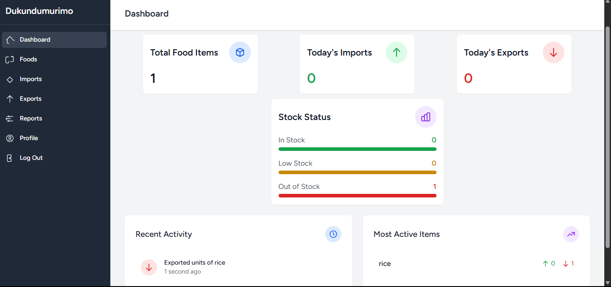
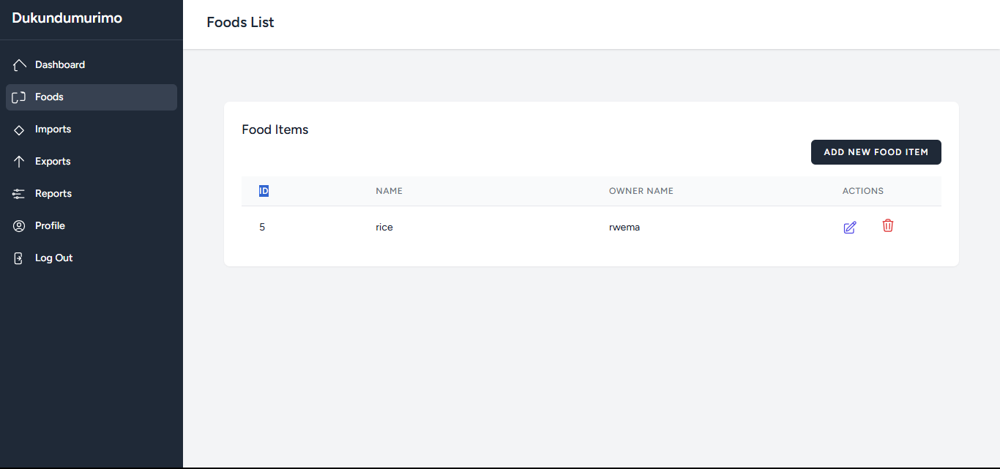
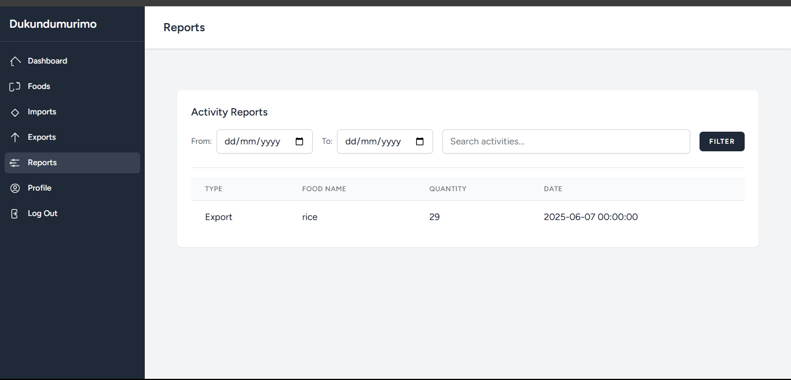

# Dukundumurimo Food Inventory Management System

## Project Overview

Dukundumurimo is a web-based food inventory management system built with Laravel. It provides a dashboard for quick insights, allows managing food items, tracking imports and exports, and generating comprehensive reports with advanced filtering capabilities.

## Features

*   **Dashboard**: A clear overview of total food items, today's imports/exports, and stock status (In Stock, Low Stock, Out of Stock).
*   **Food Management**: CRUD (Create, Read, Update, Delete) operations for food items.
*   **Imports**: Record new food imports with quantity and date.
*   **Exports**: Record food exports with quantity and date.
*   **Reports**: Generate detailed activity reports filtered by date range and searchable by food name or activity type.
*   **User Authentication**: Secure login, logout, and user profile management.
*   **Modern UI**: Clean and responsive design using Tailwind CSS.

## Prerequisites

Before you begin, ensure you have the following installed on your system:

*   **PHP** (>= 8.0)
*   **Composer**
*   **Node.js** (LTS version recommended) & **npm**
*   **MySQL** (or another database supported by Laravel)
*   **Git** (for cloning the repository)

## Installation

Follow these steps to get your Dukundumurimo project up and running:

1.  **Clone the repository**:
    ```bash
    git clone <your-repository-url>
    cd starter 2/duku
    ```

2.  **Install PHP Dependencies**:
    Navigate into the `duku` directory (where your `composer.json` is located) and install the backend dependencies:
    ```bash
    composer install
    ```

3.  **Configure Environment Variables**:
    *   Create a copy of the `.env.example` file and rename it to `.env`:
        ```bash
        cp .env.example .env
        ```
    *   Open the `.env` file and configure your database connection:
        ```env
        DB_CONNECTION=mysql
        DB_HOST=127.0.0.1
        DB_PORT=3306
        DB_DATABASE=your_database_name
        DB_USERNAME=your_database_user
        DB_PASSWORD=your_database_password
        ```
        Replace `your_database_name`, `your_database_user`, and `your_database_password` with your actual database credentials.

4.  **Generate Application Key**:
    ```bash
    php artisan key:generate
    ```

5.  **Run Database Migrations**:
    This will create the necessary tables in your database.
    ```bash
    php artisan migrate
    ```

6.  **Install Node.js Dependencies**:
    Stay in the `duku` directory and install the frontend dependencies:
    ```bash
    npm install
    ```

7.  **Compile Frontend Assets**:
    This command compiles your Tailwind CSS and JavaScript assets. **Keep this command running in a separate terminal window while developing.**
    ```bash
    npm run dev
    ```

8.  **Build for Production (IMPORTANT!)**:
    Before deploying your application to a production environment, you should build your assets for production. This will optimize and minify your CSS and JavaScript files, which is crucial for performance.
    ```bash
    npm run build
    ```

## Running the Application

Once all the steps above are completed, you can start the Laravel development server:

```bash
php artisan serve
```

Your application should now be accessible in your web browser at `http://127.0.0.1:8000` (or the address shown in your terminal).

## Database Seeding (Optional)

If you want to populate your database with some dummy data for testing, you can run the seeder:

```bash
php artisan db:seed
```

## Troubleshooting

*   If you encounter `ENOENT` errors when running `npm` commands, ensure you are in the correct directory (`duku/`).
*   If your design is missing, make sure `npm run dev` is actively running in a separate terminal window.
*   For any other errors, check your `.env` file configuration and your database connection.

---

## Screenshots

To view the screenshots, please save the provided images into the `duku/screenshots/` directory within your project.

### Dashboard


### Foods List


### Reports


---

Feel free to expand this README with more details, such as specific usage instructions for each feature or deployment guidelines.

